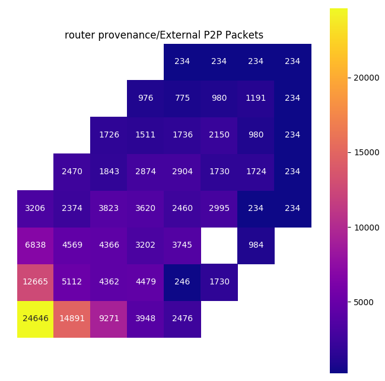

This package provides functionality which are common to front ends that
translate application level programs into executables which run on a SpiNNaker
machine.

Requirements
============

In addition to a standard Python installation, this package depends on:

    numpy
    SpiNNUtilities
    SpiNNMachine
    DataSpecification
    PACMAN
    SpiNNMan
    spalloc

These dependencies can be installed using `pip`:

    pip install numpy
    pip install SpiNNUtilities SpiNNMachine DataSpecification PACMAN SpiNNMan spalloc

If you want to use the `spinnaker_router_provenance_mapper` command line tool
to visualise the traffic on SpiNNaker boards caused by your simulations, you
should install this package using:

    pip install "SpiNNFrontEndCommon[plotting]"

This will additionally install `matplotlib` and `seaborn` to do the actual
plotting, as well as configuring the script.

Visualising SpiNNaker Board Network Traffic
===========================================

To get plots of the traffic in your simulation, use the
`spinnaker_router_provenance_mapper` command line tool (installed as described
above), passing in the name of a provenance database (usually called
`provenance.sqlite3` and created within the run's reporting folders) that
contains the raw data. This will produce a number of graphs as images in your
current directory; _those have fixed file-names._

    spinnaker_router_provenance_mapper my_code/.../provenance.sqlite3

An example of the sort of map that might be produced is:

The P2P traffic being mapped is mainly used for system boot and control.
The white square is due to a chip on that SpiNNaker board being marked as
deactivated.

Documentation
=============
[SpiNNFrontEndCommon Python documentation](http://spinnakermanchester.github.io/SpiNNFrontEndCommon/python/)
 
[SpiNNFrontEndCommon C documentation](http://spinnakermanchester.github.io/SpiNNFrontEndCommon/c/)

[Combined python documentation](http://spinnakermanchester.readthedocs.io)
